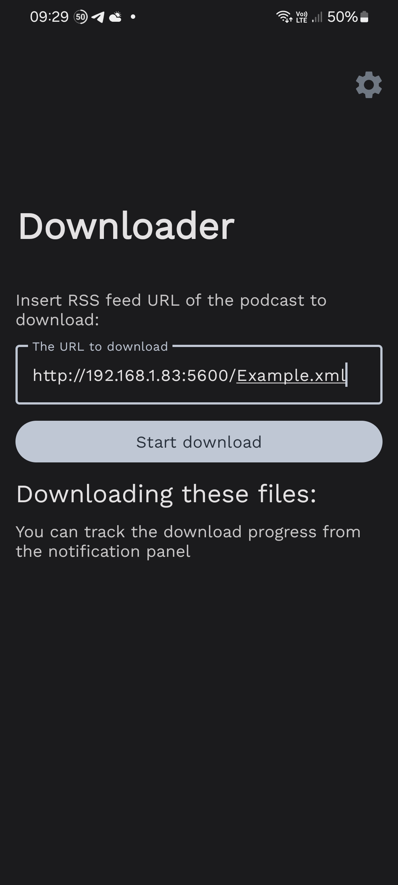
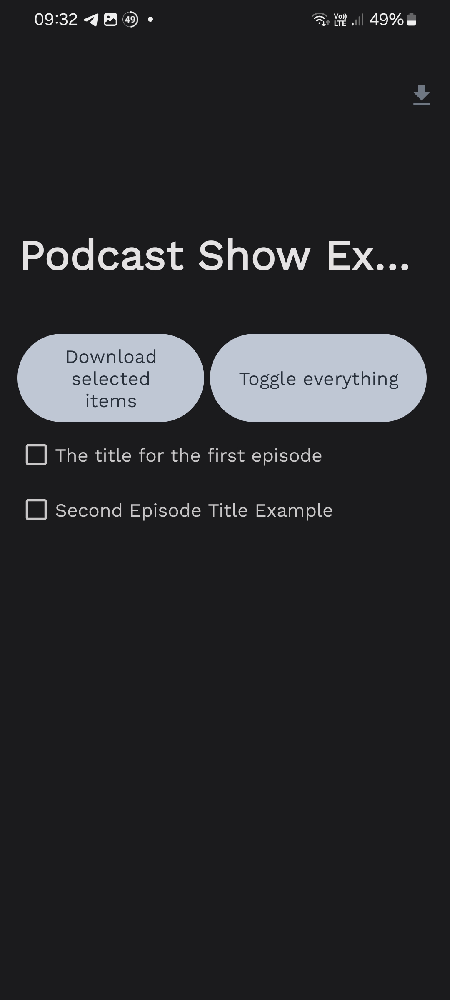
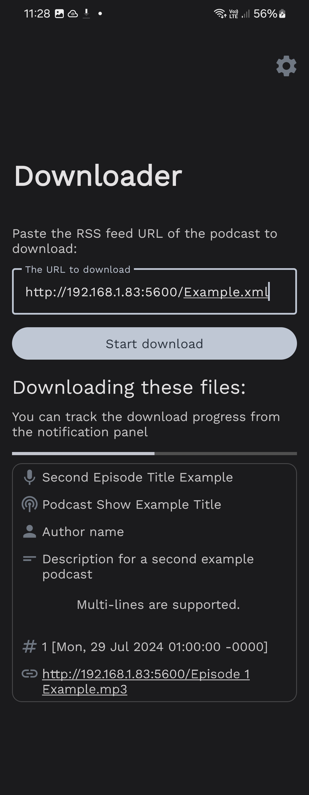
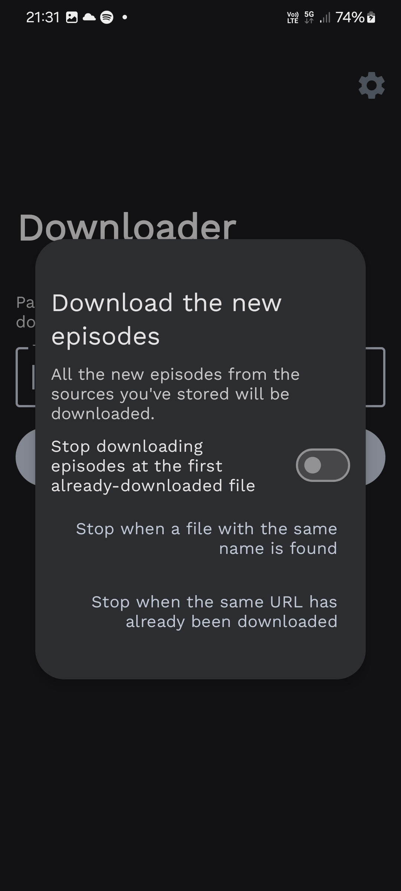
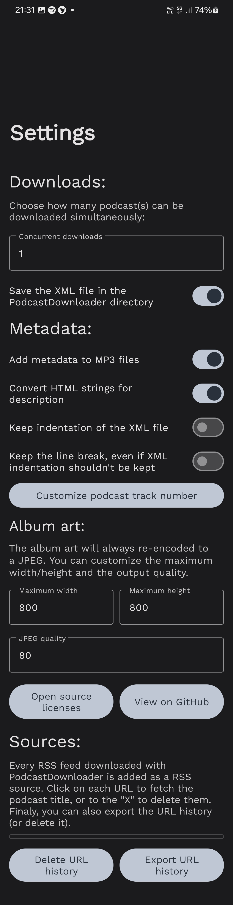
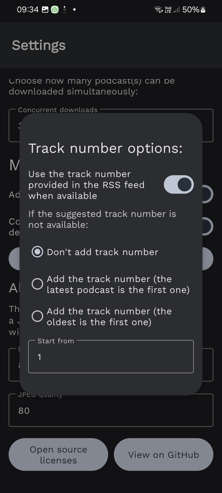

# podcast-downloader

An Android application that can download podcasts from a RSS feed.

## How it works

Find the URL of a podcast's RSS feed. Now, add it in the "Downloader" textbox.
The application will fetch all the available podcasts, and you'll be able to
select the items to download. The application will download them and, if they
are a MP3 file, add metadata. You can find screenshots for this process below.

### Download screenshots:

After you click the "Start download" button, the podcasts items will be fetched.
You'll be able to choose which elements to download:

After you've selected all the files you want to download, click on the "Download
selected items" button (or the download icon at the top).

You'll go back to the Downloader UI. Now, at the bottom you'll find the episodes
that are being downloaded. They'll disappear when the download ends.

## Downloading new episodes

Starting from version 1.1.0, PodcastDownloader keeps track of the RSS feed
downloaded, and it can download the new episodes. To do this, click on the
"Download the new episodes" button.

A dialog will appear. Here you can choose if the application should stop the
download of that RSS feed at the first file that has been already downloaded,
and how PodcastDownloader should look for duplicates. You have two options:

- Look if a file with the same name exists
- Look if the URL has already been downloaded

## Settings

In the settings, you can customize:

### Downloader settings:

- The output download folder;
- If you want to save a JSON file with all the metadata fetched of the downloaded episodes;
- The number of concurrent downloads (how many downloads can happen at the same
  time);
- If you want to save the XML file in the PodcastDownloader directory;
- The user agent.

### Metadata

- If you want to add metadata to MP3 files;
- If the description should be parsed from HTML;
- If the application should keep the XML indentation for text blocks;
- If the application should keep the new lines in the XML indentation (also if
  the XML indentation isn't kept).

#### Track number

Additional settings are available for track number customization. Here you can
choose if the suggested track number from the XML should be used, and what the
app should do if the podcast track number is unknown.

You'll also find a toggle that permits you to use the last track number options you've used to download a specific podcast for automatic downloads. Let's say that you have downloaded the `Podcast A`, whose file count started from `0`, and the `Podcast B`, whose file count started from `1`. Now you want to download the new episodes, so you click on the `Download the new episodes` button. If you have this toggle enabled, the app will keep in mind that the `Podcast A` count should start from `0`, but if you have this toggle disabled the app will always start the count from `1` (the last value used). It's suggested to keep this enabled so that you can have consistency between track numbers.

### Album Art

If possible, podcast-downloader autiomatically downloads the album art, and
it'll re-encode it to a JPEG. You can customize:

- The maximum width and the maximum height
- The JPEG quality

### Sources

PodcastDownloader will automatically save every RSS feed in the "Sources"
section. Here you can click on each feed to show its title, or click the "X" to
delete it. These sources are the ones used to download the new podcasts.

In this section, you can also delete or export the URL history.

## Disclaimer

This application is licensed under the MIT license. The user is responsable for
the usage of this tool.
